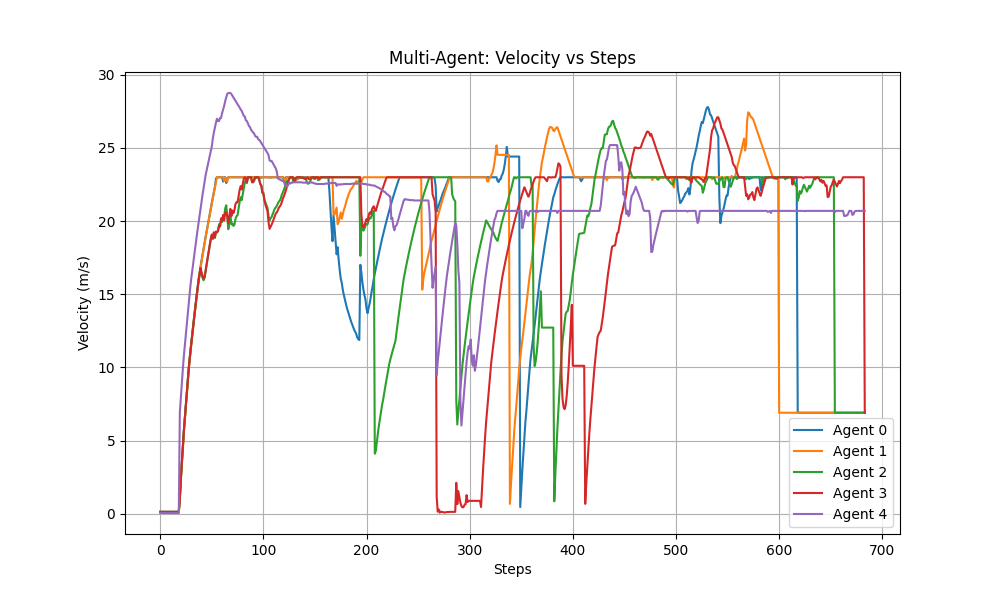
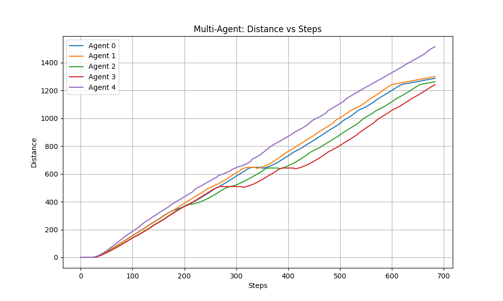
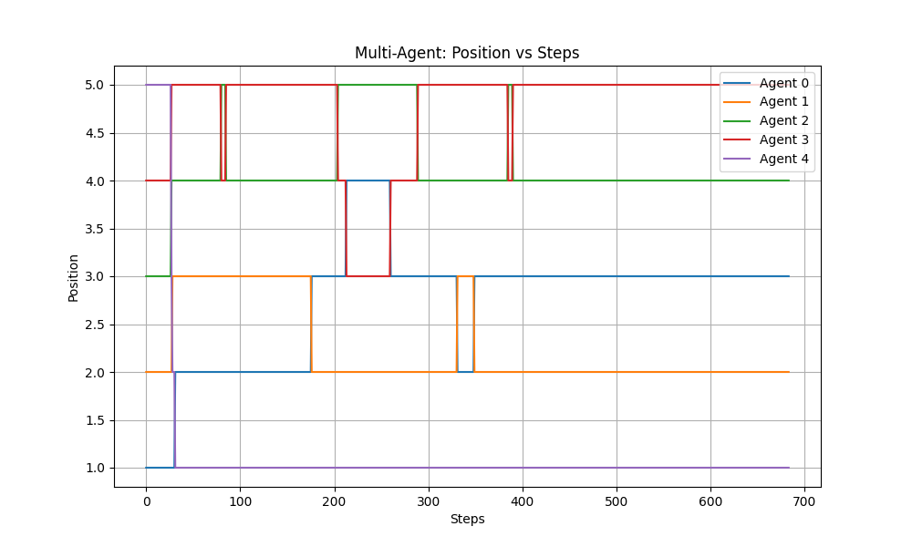

# Rapport Hebdomadaire - Semaine 10

**Date :** 9/5/2025  

---

**TL;DR**  
Les semaines précedantes, nous avons changé l'environement pour permettre des lancements de simulations avec un nombre d'agents virtuellement illimité. On a aussi commencé a travaillé sur le rapport final du projet et l'analyse des differentes courbes.


## A. Travail réalisé cette semaine

### 1. Concernant le lancement d'une simulation avec une multitude d'agents

#### Problèmes rencontrés et défis techniques

Durant la réalisation de cette tâche, nous avons rapidement identifié un problème majeur dans le lancement des agents, qui ne provenait pas directement de notre code. En effet, nous avons été confrontés à un problème assez embêtant dont la source se trouvait dans le code du package `pystk`, que nous avons installé avec `pip install pystk2-gymnasium`.  

Nous ne savons toujours pas pourquoi le code placé dans le dossier `src/pystk2-gymnasium` n’est pas pris en compte. À la place, c’est le code téléchargé directement via `pip install pystk2-gymnasium` qui est utilisé. Même après avoir vérifié les différents `import` (qui indiquent pourtant que le code utilisé devrait venir de `src/pystk2-gymnasium`), nous n’avons pas encore identifié le problème exact.  

À cause de cela, nous avons dû modifier directement le code téléchargé, ce qui a pour conséquence que ces modifications ne sont pas visibles dans GitHub.


#### Modifications apportées au code

Les modification qui on été apportées au code sont les suivantes : 

Dans le `envs.py` :

- ligne 504
```py 
ranked_positions = [agent.rank_start for agent in agents if agent.rank_start is not None]

assert all(pos < self.num_kart for pos in ranked_positions), "Karts must have all have a valid position"
assert len(set(ranked_positions)) == len(ranked_positions), "Some agents have the same starting position"

self.free_positions = [ix for ix in range(self.num_kart)if ix not in ranked_positions]
```

- ligne 540
```py 
for agent in self.agents:
    if agent.rank_start is not None:
        kart_ix = agent.rank_start
    else:
        kart_ix = next(pos_iter)
```


### 2. Concernant l'analyse des differents tracks et les performance des agents 

#### Analyse des performances multi-agents

##### Répartition des agents

- **Agent 0 → EulerAgent**  
- **Agent 1 → ItemAgent (version Euler)**  
- **Agent 2 → ItemAgent (version Median)**  
- **Agent 3 → MedianAgent**  
- **Agent 4 → ExpertBot (fourni par SuperTuxKart)**

---

##### 1. Graphique : Velocity vs Steps



- **ExpertBot (Agent 4)** démarre plus vite et atteint une vitesse de pointe (~27–28 m/s) plus rapidement que les autres, mais montre ensuite une baisse notable autour de 200–300 steps, avant de se stabiliser à ~21 m/s.
- **ItemAgent (Euler) (Agent 1)** a une montée rapide et reste assez stable autour de 22–25 m/s, avec quelques chutes brutales, dues à une mauvaise utilisation d’items ou des collisions.
- **ItemAgent (Median) (Agent 2)** et **MedianAgent (Agent 3)** ont des progressions plus irrégulières avec plusieurs baisses de vitesse, suggérant qu’ils rencontrent plus de perturbations (mauvaise trajectoire, collisions, ou gestion d’items moins efficace).
- **EulerAgent (Agent 0)** montre plusieurs chutes brusques après ~200 steps, ce qui indique des problèmes de stabilité dans sa vitesse moyenne.

**Résumé :** ExpertBot et ItemAgent (Euler) maintiennent les meilleures vitesses moyennes ; EulerAgent a des baisses de performance visibles ; MedianAgent et ItemAgent (Median) sont plus instables.

---

##### 2. Graphique : Distance vs Steps



- **ExpertBot (Agent 4)** domine clairement la distance totale, atteignant environ 1500 m à la fin (~700 steps), montrant son efficacité et sa constance.
- **ItemAgent (Euler) (Agent 1)** suit de près, légèrement devant EulerAgent (Agent 0) et MedianAgent (Agent 3), qui eux sont très proches.
- **ItemAgent (Median) (Agent 2)** est légèrement derrière ce groupe.

**Résumé :** Le bot expert reste le plus performant en distance ; l’ItemAgent (Euler) profite bien de ses capacités supplémentaires, tandis qu’EulerAgent et MedianAgent restent en milieu de peloton ; l’ItemAgent (Median) est légèrement en retrait.

---

##### 3. Graphique : Position vs Steps



- **ExpertBot (Agent 4)** est en **1ère place** la plupart du temps.
- **ItemAgent (Euler) (Agent 1)** et **EulerAgent (Agent 0)** oscillent entre la 2ᵉ et 3ᵉ place.
- **MedianAgent (Agent 3)** est souvent 4ᵉ ou 5ᵉ, mais monte parfois en 3ᵉ place.
- **ItemAgent (Median) (Agent 2)** fluctue également, mais reste souvent 4ᵉ.

**Résumé :**  
ExpertBot domine. ItemAgent (Euler) est le plus compétitif face au bot expert. EulerAgent est globalement solide, tandis que les agents basés sur Median (MedianAgent et ItemAgent Median) peinent à rivaliser.

---

##### Analyse générale

- **ItemAgent (Euler)** bénéficie clairement d’un bon équilibre entre vitesse et distance grâce à une meilleure gestion des items.
- **MedianAgent** et **ItemAgent (Median)** souffrent de chutes de performances, possiblement à cause d’une mauvaise stratégie d’item ou d’un algorithme de trajectoire moins réactif.
- **EulerAgent** montre des signes de stress à long terme (baisses de vitesse), mais reste globalement compétitif.
- **ExpertBot** reste le modèle de référence, difficile à battre sans optimisations plus poussées.


### 3. Concernant les modifications apportée au rapport finale

Il a fallu modifier le **Mid Semester Report** pour aboutir à la version **Final Report**. Ce n'est qu'un draft pour l'instant.

#### 1 . Changement de l'intoduction 

* Dans l’**Abstract**, la portée a été élargie : on mentionne désormais explicitement l’**ItemsAgent**, l’usage de *pystk2* et des visualisations Plotly, ainsi que la perspective d’intégrer du **reinforcement learning** après le projet.

* L’intro met désormais en exergue l’abandon du *StayInTheMiddleAgent* au profit du **MedianAgent** comme premier agent “solide”, et présente d’entrée de jeu les trois agents actuellement maintenus (*MedianAgent*, *EulerAgent*, *ItemsAgent*).

* Le lien avec les visualisations et la roadmap est posé dès cette section, alors que dans le draft intermédiaire ces éléments n’étaient évoqués qu’en fin de document.

#### 2 . Ajout de la section **Glossary** comparé au rapport intermédiare

* Une section autonome **Glossary** (section 2) a été insérée juste après l’introduction pour définir les termes clés : *Acceleration Logic*, *n‑th Node*, *Peripheral Vision*, etc. Elle n’existait pas dans le rapport intermédiaire et clarifie le jargon avant d’entrer dans l’analyse détaillée.

#### 3 . Extension de **Analysis of Provided Scripts**

* La section a été subdivisée en sous‑sections plus fines : `__init__.py`, `definitions.py`, `envs.py`, etc., chacune décrivant classes, algorithmes et API internes (ex. **Phase Enum**, **STKAction Class**, reward shaping, etc.).
* Des algorithmes clés (e.g., *Global‑to‑Kart Coordinate Conversion*, *Sorting Karts and Items by Distance*) sont maintenant explicités pseudo‑code à l’appui .

#### 4 . Création de la section **Technical Data Sheets and Analysis** consolidée

* Dans l’intermédiaire, chaque fiche technique était reléguée en annexe ; elles sont à présent centralisées dans une section principale, avec rappels synthétiques avant de renvoyer vers les annexes détaillées.
* Pour **EulerAgent**, on ajoute une sous‑partie *Mathematical Models and Formulas* (courbure, vitesse limite, Fresnel integrals, etc.) directement dérivée de la littérature MIT ; ces équations n’apparaissaient pas auparavant.

#### 5 . Enrichissement de **Additional Utilities**

* La partie sur **TrackUtils** / **TrackPathWrapper** est reprise mais complétée par l’algorithme *Selecting the Node to Target* (Algorithm 4) et des captures illustratives. Cela répond à la critique “visualisation insuffisante” du mid‑term.

#### 6 . Nouvelle sous‑section **Future Agents**

* Au lieu d’un simple “Future Works”, le final détaille **Future Agents** : stratégie de combinaison dynamique entre agents existants et plan d’intégration du RL (reward function design, exploration strategy).

#### 7 . Documentation exhaustive de l’API `env.unwrapped`

* Un tableau très complet listant méthodes et rôles (de `reset()` à `warmup_race()`) apparaît en annexe ; il sert de référence rapide au jury et n’était pas inclus dans la version précédente.

-> Toutes ces modifications ne sont peut-etre pas apportées tout de suite dans la version proposée pour cette réunion, mais c'est un début. 

---

## B. Prochaines étapes

### Rapport détaillé

L’objectif pour la suite de cette UE est d’essayer de proposer un rapport détaillé de ce que nous avons fait tout au long de cette UE, et d’expliquer avec clarté et technicité les différentes découvertes que nous avons faites durant nos recherches.

### Analyse des performances

Nous comptons proposer des analyses des performances de nos différents agents en fonction de la piste sur laquelle ils se trouvent et de leurs adversaires.

### Finalisation de l’`ItemAgent`

Nous sommes en ce moment même en train de finaliser le dernier agent, l’`ItemAgent`, avec la capacité d’utiliser les items au moment opportun.

### Complétion du GitHub

Enfin, nous prévoyons de compléter le GitHub avec les informations qui nous manquent (un README complet et une partie pour expliquer rapidement la structuration du projet).


---

**Rapport rédigé par :** Mahmoud
**Vérifié par :** Badr, Wilson, Safa  